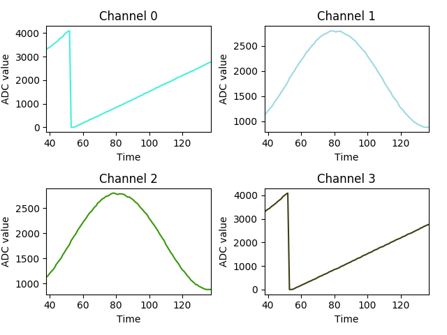

# ESP32

[Pinout reference](https://raw.githubusercontent.com/playelek/pinout-doit-32devkitv1/master/pinoutDOIT32devkitv1.png)

## Enviroment Setup

### Using the [Arduino IDE](https://www.arduino.cc/en/Main/Software)

* Go to Files > Preferences and add <https://dl.espressif.com/dl/package_esp32_index.json> in Additional Boards Manager URLs

* Go to Tools > Boards > Board Managers, search for esp32 and install

### Using the [PlatformIO Cli](http://docs.platformio.org/en/latest/)

* To install plataformIO cli on debian based distros:

```console
user@computer:~$ sudo python -c "$(curl -fsSL https://raw.githubusercontent.com/platformio/platformio/develop/scripts/get-platformio.py)"
```

* To create a new project do:

```console
user@computer:~/project_folder$ pio init --board=node32s
```

* To compile:

```console
user@computer:~/project_folder$ pio run
```

* To upload:

```console
user@computer:~/project_folder$ pio run -t upload --upload-port=/dev/ttyUSB0
```

## [Serial Plotter](./serialPlotter)

Python utility to plot the data present in a serial port formatted in CSV.



* Usage:

```console
user@computer:~/serialPlotter$ python main.py
```
